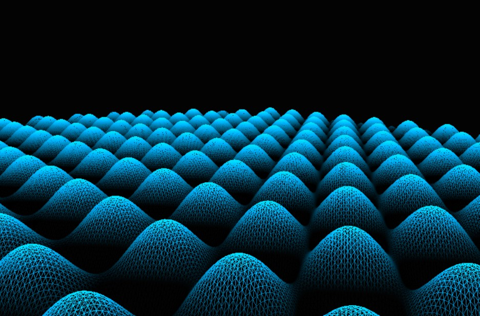
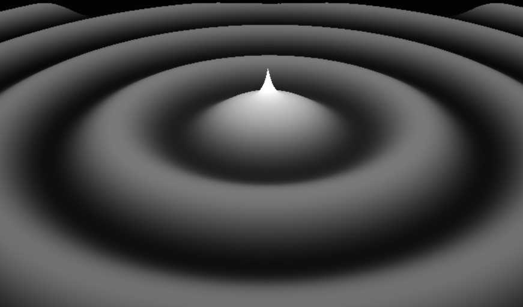
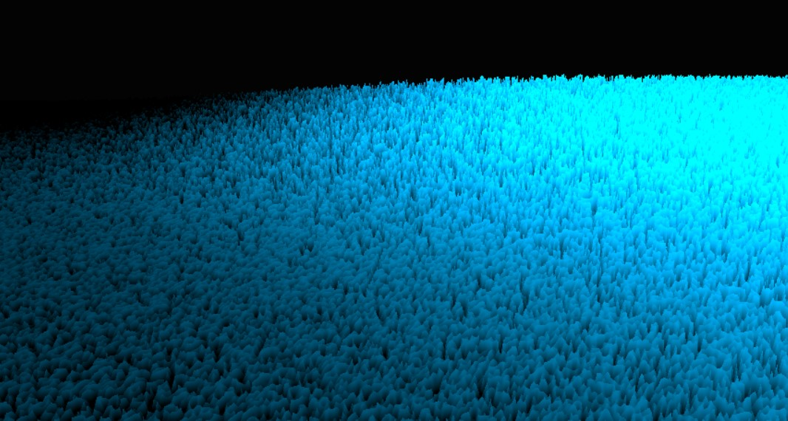

# The power of providing our shaders with a notion of time

   

Shaders play a key role in any graphics pipeline, and they are executed directly in our GPU, which means that they provide an incredible power of computation. That's why we want to run as many tasks as we can there. However, we need to pass them some data through our CPU in order to perform those tasks.

Let's think now in a terrain from the perspective of computer graphics: we could create just a grid of points and set a texture on top of them. We can create and organize all this information in our CPU, and pass it to our shaders to do their job. We just have to pass all this information once, in the beginning, so it's not a big deal.

However, what if we want to move this grid of points? Would it be efficient to update the position of all of our points in our CPU and then send again all that information into our shaders in a loop? It would be much simpler if we could update the position of every vertex in the vertex shader, to use all the parallelization power that our GPU has.

However, this has an inconvenience: by default, our shaders don't have a persistent memory. There are buffers to achieve this, but should be a more intelligent way to avoid that if we just want to update the position based on a simple "evolution" function.

But, what does a function need to produce a value? It needs an independent variable. We have position, but we need a variable that changes, which could be time. And time can be expressed with just a number, which can be easily sent from our CPU to our shaders in every iteration of our graphics pipeline.

All the simulations that you will see in this project just need a grid of initial values and this notion of time. And you will see that we can achieve pretty cool results just by playing with that in our vertex and fragment shaders.

Finally, another good thing about shaders is that we can compile and attach them to the graphics pipeline during runtime. This allows us to change our shaders during runtime, by using a keyboard input for example, and with that, we can change the whole look of our simulator just by pressing a key.